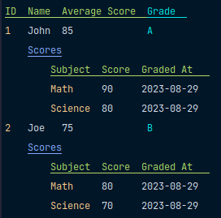

# table
[](https://codecov.io/github/data-preservation-programs/table)
[](https://goreportcard.com/report/github.com/data-preservation-programs/table)
[](https://pkg.go.dev/github.com/data-preservation-programs/table)
[](https://github.com/data-preservation-programs/table/actions/workflows/go.yml)

A simple library to create nested tables in the terminal.

## Installation

```bash
go get github.com/data-preservation-programs/table@latest
```

## Example Usage
```go
type Person struct {
	ID           int
	Name         string
	AverageScore int     `table:"header:Average Score"`
	Grade        string  `table:"color:96;headerColor:96,4"`
	Scores       []Score `table:"headerColor:34,4;expand"`
}

type Score struct {
	Subject  string
	Score    float32
	GradedAt time.Time `table:"header:Graded At;format:2006-01-02"`
}

func main () {
    fmt.Println(table.New().Render([]Person{...}))
}
```



## Supported Tags
* `header` The header string to use for the column.
* `headerColor` The color to use for the header. The color is specified as a comma separated list of color codes. Check available values [here](https://github.com/fatih/color/blob/main/color.go)
* `color` The color to use for the column. The color is specified as a comma separated list of color codes. Check available values [here](https://github.com/fatih/color/blob/main/color.go)
* `format` The format to use for the column. For `time.Time`, the format is specified as a [Go time layout](https://pkg.go.dev/time#pkg-constants). For all other types, the format is specified as a [Go format string](https://pkg.go.dev/fmt#hdr-Printing).
* `verbose` If set to true, the column will be displayed only when the verbose is set to true in the `Table`.
* `expand` If set to true, the column will be expanded to a sub table. The column needs to be a slice/instance/pointer to a struct.
* `-` If specified, the column will be hidden.

## Supported Options
* `Table.WithTab` Set the tab string that is appended to the sub-tables.
* `Table.WithVerbose` Columns with `verbose` tag is only displayed when the verbose is set to true.
* `Table.WithPaddingSize` Set the padding size for each column which is the minimum padding between the columns.
* `Table.WithHeaderRowColor` Overrides the default header row color.
* `Table.WithFirstColumnColor` Overrides the default first column color.
